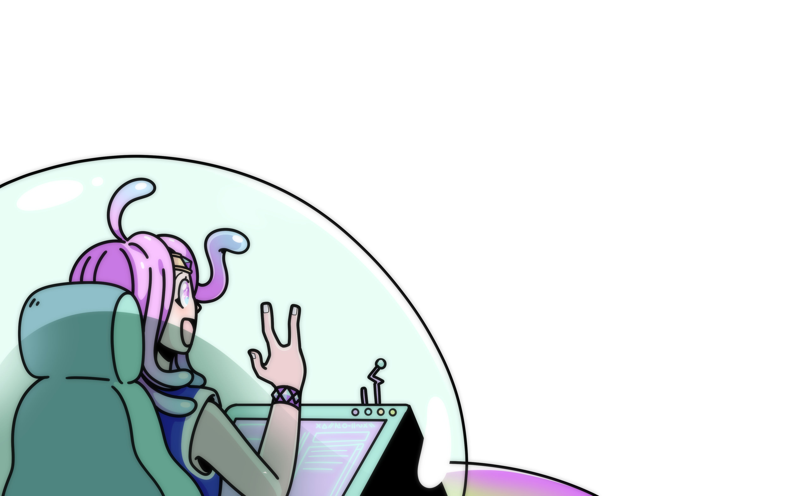

## Le jeu, un vecteur d'apprentissage puissant
Avez-vous déjà remarqué à quel point votre enfant, ou même vous, peut rester concentré des heures sur un défi dans un jeu ?
Alors qu'il décroche après dix minutes de cours magistral ?

Ce n'est pas un hasard et le secret réside dans l'immersion et l'engagement. 

Le jeu n'est pas une simple distraction, c'est une expérience sensorielle et émotionnelle profonde qui favorise l'acquisition de nouvelles connaissances et le développement de nouvelles compétences. 

## L’immersion sensorielle : Quand le corps et l’esprit apprennent ensemble
Contrairement à l'apprentissage traditionnel, le jeu propose ce que les chercheurs appellent une "**cognition située**"[^1] : les connaissances ne sont pas que des éléments à mémoriser, elles deviennent des outils pour agir et progresser dans le jeu, elles sont directement liée à l'expérience vécue par le joueur. Par exemple, un joueur n'apprend pas seulement ce qu'est la "gravité" et les lois de Newton en théorie, il en ressent les effets sur son avatar, lors d'un saut ou d'une chute, ce qui donne un sens pratique à ces notions.

De plus, pour faire comprendre au joueur ce qui est attendu de lui, le jeu utilise plusieurs support sensoriels : les images, les sons, les sensations corporelles par retour haptique par exemple. L'engagement de plusieurs sens (vue, ouïe, toucher/mouvement) crée un environnement d'apprentissage riche où les informations se complètent : c'est la **multimodalité**[^2]. Cet environnement stimule des réseaux neuronaux étendus, allant des cortex sensoriels aux régions motrices.[^3]

## L’engagement émotionnel : Le plaisir de la "frustration positive"
L'émotion est le carburant de la mémoire, ce qui fait de l'engagement émotionnel un moteur d'apprentissage puissant.

Biologiquement, l'expérience ludique libère de la dopamine, un signal de récompense qui favorise la plasticité cérébrale et consolide les nouvelles notions[^4]. Si l'équilibre optimal entre les capacités du joueur et la difficulté du défi est atteint, l'état de **flow** apparaît, transformant l'effort en plaisir et rendant les tâches difficiles "vitalisantes" plutôt que décourageantes[^5]. La motivation est renforcée et un cercle vertueux d'apprentissage se met en place. Les acquis sont ancrés durablement[^4]. 

Par ailleurs, si l'apprenant projette ses propres espoirs sur son avatar, l'engagement est renforcé : l'acquisition de compétences devient nécessaire au succès de son « double » virtuel. C'est l'**identité projective**[^5].

## Apprendre à apprendre

Le jeu offre également un espace sûr où l'échec est sans conséquence réelle, ce qui encourage la prise de risque et l'expérimentation. C'est d'ailleurs comme ça que le joueur découvre les règles du jeu et comprends comment avancer : il forme des hypothèses, les teste et s'ajuste en conséquence. C'est le principe même de la méthode scientifique[^6]. 

## Conclusion
En engageant le ressenti et l'émotion, le jeu permet une structuration des connaissances bien plus intuitive et durable que le cours magistrale. En offrant un espace d'expérimentation sécurisé, il permet de déveloper la capacité à oser. 

Jouer va bien au delà du moment de détente, c'est vivre une expérience qui nous transforme.

[^1]: Craft, J. (2004). A review of what video games have to teach us about learning and literacy. Curriculum Inquiry, 34(4). (Note : Il s'agit de la recension critique officielle de l'ouvrage de J. P. Gee).
[^2]: Gee, J. P. (2003). What video games have to teach us about learning and literacy. Palgrave Macmillan / Information Technology Services.
[^3]: Shaheen, A., Whitehead, L., & Fotaris, P. (2025). Neuroplastic reflective game design: A framework bridging neuroscience and game-based learning. In Proceedings of the International Conference on Game-Based Learning.
[^4]: Bavelier, D. (2019). Leveraging video games to promote brain plasticity and learning [Laureate Lecture]. Klaus J. Jacobs Research Prize, Jacobs Foundation.
[^5]: Gee, J. P. (2003). What video games have to teach us about learning and literacy. Blog da UFES. Repéré à https://blog.ufes.br/
[^6]: Greenfield, P. M. (1994). Les jeux vidéo comme instruments de socialisation cognitive. Greenfield Laboratory for Culture and Human Development, University of California, Los Angeles (UCLA).
