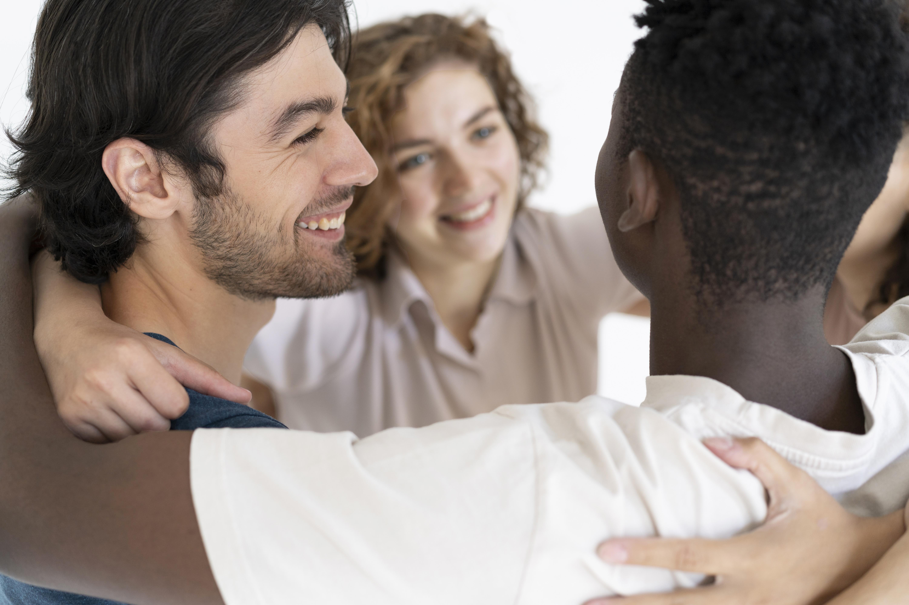

## Qu’est-ce que la santé mentale positive ?

Lorsqu'on parle de santé, on pense souvent d'abord au corps. Pourtant, l'Organisation mondiale de la Santé (OMS) définit i
la santé comme un état de complet bien-être physique, mental et social[^1].Il n'y a donc "pas de santé sans santé mentale"[^2].

Santé publique France structure notre compréhension de la santé mentale autour de trois dimensions complémentaires :

1. **La santé mentale positive** : Elle représente le sentiment de bien-être général, la capacité de se réaliser et 
l'épanouissement social au sein de la famille, du travail ou de la communauté[^2]
2. **La résilience** : C'est la capacité d'une personne à faire face à la détresse psychologique et aux épreuves inévitables 
de la vie, comme un deuil ou une rupture, en mobilisant ses ressources d'adaptation (_coping_)[^1]
3. **Les troubles psychiatriques** : Ils concernent la présence ou l'absence de maladies mentales (passagères ou permanentes) 
comme la dépression ou les troubles anxieux

## La santé mentale positive : un pouvoir d'agir

La santé mentale positive ne se résume pas à l'absence de troubles. C'est un “**état de bien-être** dans lequel la personne 
peut se réaliser, surmonter les tensions normales de la vie et accomplir un travail productif”[^2]. Elle repose sur la **qualité 
de nos relations sociales** et notre **sentiment d'autonomisation**, aussi appelé _empowerment_[^2].

## Le socle : les compétences psychosociales (CPS)

Pour construire cet équilibre, nous mobilisons nos **compétences psychosociales**. Ce sont des ressources psychologiques 
(cognitives, émotionnelles et sociales) qui nous permettent de répondre efficacement aux défis du quotidien[^3].

Ces compétences incluent[^1]:
- **Les compétences cognitives** : Comme la capacité à avoir conscience de soi ou à prendre des décisions constructives
- **Les compétences émotionnelles** : Savoir identifier, comprendre et réguler ses émotions et son stress
- **Les compétences sociales** : Communiquer de façon constructive et développer des relations saines

En développant ces capacités, nous apprenons à mieux satisfaire nos besoins psychologiques fondamentaux 
(autonomie, compétence, lien social), ce qui est essentiel pour maintenir une santé globale et durable[^2].

## Pour allez plus loin

Le site de l'agence nationale de santé publique, [Santé publique France][1], met à disposition une page dédiée et 
des ressources complètes sur la santé mentale.

[^1]: Santé publique France. (2023). _Les compétences psychosociales : l’essentiel à savoir._ Saint-Maurice : Santé publique France.
[^2]: Santé publique France. (2025). _Les compétences psychosociales : un référentiel opérationnel à destination des professionnels experts et formateurs CPS. Tome I_. Saint-Maurice : Santé publique France.
[^3]: Santé publique France. (2026). _Le programme d’action de Santé publique France sur les compétences psychosociales._ Repéré à [https://www.santepubliquefrance.fr][1].

[1]:https://www.santepubliquefrance.fr/

