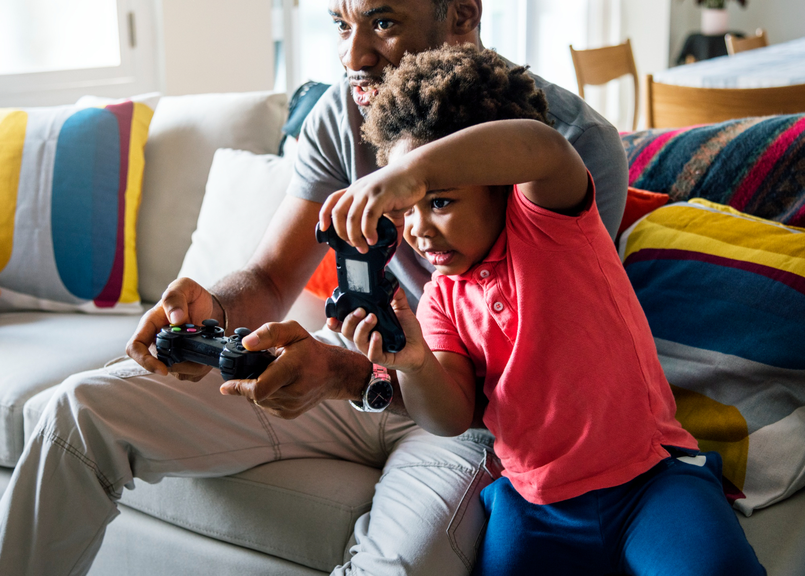

## Concrètement, qu’est-ce qu’une “utilisation saine” des jeux vidéo ?

Le jeu vidéo est aujourd’hui un objet culturel central qui peut favoriser la créativité et la résolution de problèmes[^1]. 
Pour que cette pratique reste bénéfique, quelques habitudes simples sont à mettre en place pour toute la famille.

## 1. Limitez le temps d'écran

Une introduction progressive est essentielle pour protéger le développement de l'enfant. Jusqu'à 3 ans (et idéalement 4 ans), 
il est fortement recommandé d'éviter toute exposition aux écrans, car les interactions avec le monde réel en trois dimensions 
sont vitales pour le développement du langage et de la motricité.[^2][^3][^4]

À partir de 4 ans, le jeu vidéo peut être introduit de manière très limitée et occasionnelle, toujours sous l'encadrement 
d'un adulte et sans dépasser une heure consécutive[^1][^3].
Plutôt que de fixer un "temps quotidien" qui ritualise la pratique, privilégiez une logique hebdomadaire (par exemple, 
uniquement le week-end) pour éviter l'installation d'une routine quotidienne[^1]. 
Enfin, préservez absolument le sommeil en interdisant les écrans dans l'heure précédant le coucher, la lumière bleue et 
l'excitation perturbant les rythmes biologiques[^1].

[^1]: Piki & Co (2026) [Le jeu, un vecteur d'apprentissage puissant][1]
[^2]: Commission d'experts. (2024). Enfants et écrans : À la recherche du temps perdu. Rapport remis à la Présidence de la République française.
[^3]: Société Française de Pédiatrie, Société Française d’Ophtalmologie, et al. (2025). Les activités sur écrans ne conviennent pas aux enfants de moins de 6 ans. Tribune collective.
[^4]: Rufat, S., Ter Minassian, H., & Coavoux, S. (2014). Jouer aux jeux vidéo en France : Géographie sociale d’une pratique culturelle. L’Espace géographique, 43(4), 308-323.
[^5]: Tisseron, S. (2008). La règle 3-6-9-12. (Recommandation citée et analysée dans le rapport de la Commission d'experts, 2024).

[1]:https://piki-and-co.com/blog/learningwithgames/
